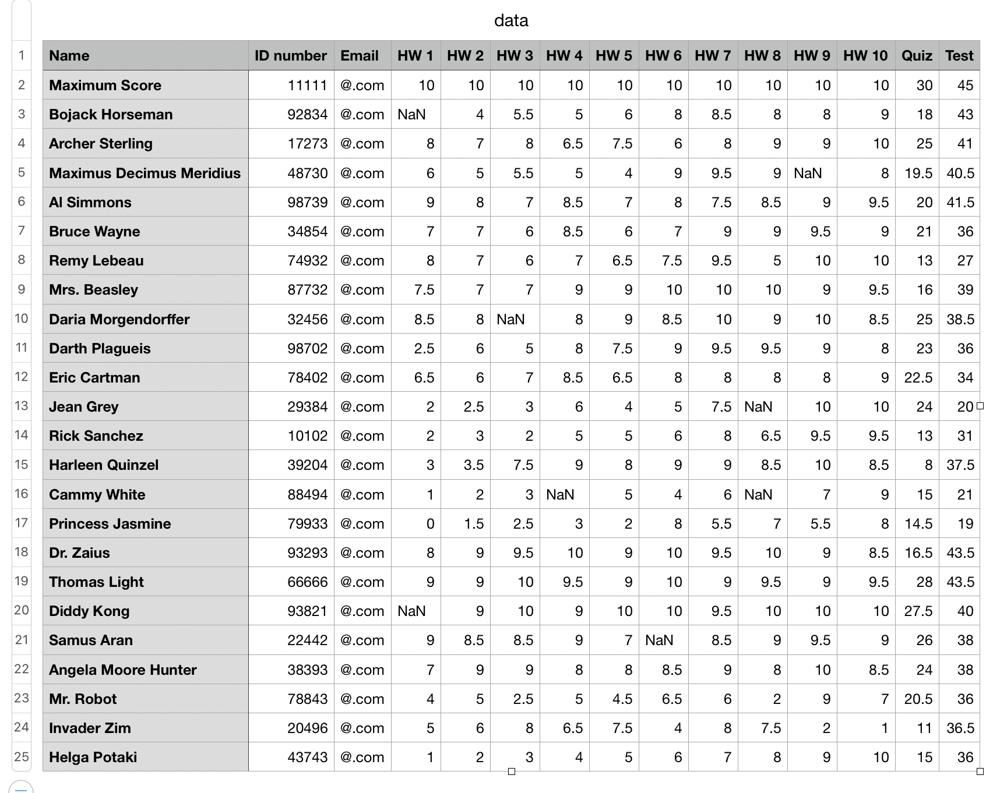

# Repo:    grade-book

The purpose of this code is to automate the assignment of grades.

## Description

Given the path to a file containing student scores, one can calculate various statistics, assess student improvement, and assign grades to scores. The user must specify the index of each column that corresponds to a particular score or student attribute before reading in a data-file; valid extensions for the data-file include ".txt", ".csv", or ".xlsx". The grade-book works by initializing dictionary data separately for "home-work", "quiz", "test", and "extra credit" before aggregating results. This code is a functional roughdraft - it's a bit messy to debug and modify; I intend to organize this code to be less bloated at some point in the future. 

The image above is a screenshot of fake student names and scores used as an example. The first row (indexed by `0`) shows the maximum score for each assignment; all rows below the first row correspond to a student. The first column (indexed by `0`) shows the student name. To differentiate between missing scores and zero-scores, missing scores are denoted by NaN (Not a Number).

One can specify the grade-boundaries; if `points_at_ace` is not provided, then the minimum number of points to earn an $A+$ is $95$ % of the maximum possible point total (not including extra credit scores, if provided); if `points_at_fail` is not provided, then the maximum number of points to earn a $D-$ is given as `points_at_ace / 2`. One can also specify the grade-boundaries in-between `points_at_ace` and `points_at_fail`; if not provided, then the boundaries are selected to allocate an equal number of points to each sub-division. In addition to this, one can choose `side_bias="left"` (lower-bound $\leq$ score $<$ upper-bound ) or `side_bias="right"` (lower-bound $<$ score $\leq$ upper-bound ). This example uses `points_at_fail=80`, `points_at_ace=150`, and `side_bias="left"`.

This code can apply flat curves and improvement curves. A flat curve is a curve that allocates the same number of points to each student; conversely, the improvement curve is based upon the difference of the weighted average of the second-half of scores and the first-half of scores, and is calculated by multiplying this value by a scale-factor. For this example, the home-work improvement curve would compare the second-half of scores (HW 6 $-$ 10) with the first half of scores (HW 1 $-$ 5). The final scores are recalculated each time the curves are updated or removed. When calculating curves, missing scores are treated as zero-scores.

Once the grade-book is initialized, one can view this data in a variety of plots. 

* Histogram of scores
  
  * view by particular assignment (for example, "HW 1")
  
  * view by particular categories (for example, "home-work")
  
  * view by grade
    
    

* Heat-map of score differences
  
  * view by particular assignment
  
  * view by particular categories
  
  * view by total

* Box-plot of score statistics
  
  * view by particular assignment
  
  * view by particular categories
  
  * view by total
  
  * view statistics by points or by percentage (useful if assignments or categories are weighted differently)

* Cumulative bar-stacks
  
  * view by particular assignment or by particular categories

* Polar charts
  
  * view grades distribution as:
    
    * pie-chart
    
    * donut-chart
    
    * annular chart

* Table
  
  * view table of data with point totals and grades
  
  * output the updated dataframe

## Getting Started

### Dependencies

* Python 3.9.6
* numpy == 1.26.4
* matplotlib == 3.9.4
* pandas == 2.2.3
* collections (default)

### Executing program

* Download this repository to your local computer

* Modify `path_to_data` and `path_to_save_directory` in `src/example_01-back_end.py` and then run the script

## Version History

* 0.1
  * Initial Release

## To-Do

* modify heat-maps by either transforming 2-D data or by moving xticklabels from bottom x-axis to top x-axis

* fix `missing number student scores` in legend of heat-maps

* add email functionality

* add gui

## License

This project is licensed under the Apache License - see the LICENSE file for details.
